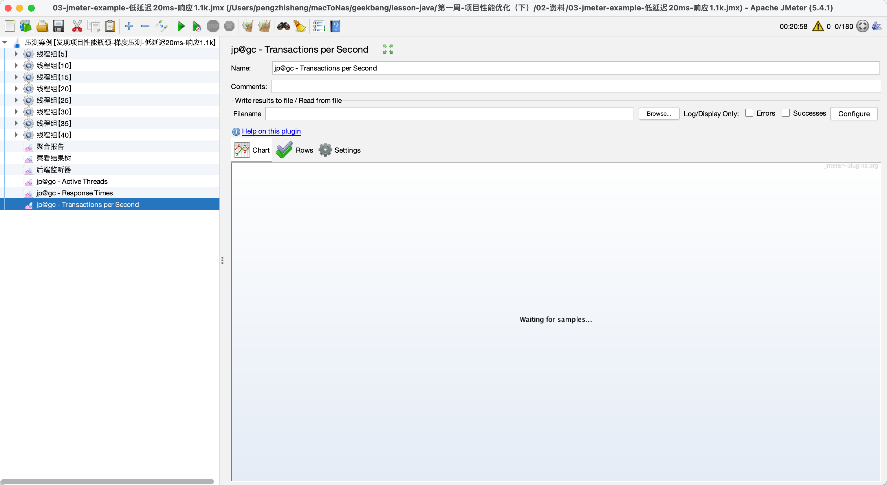
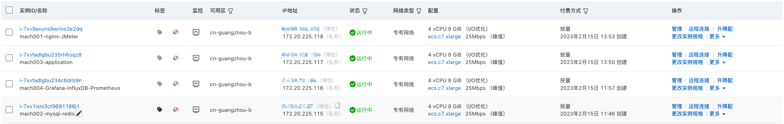
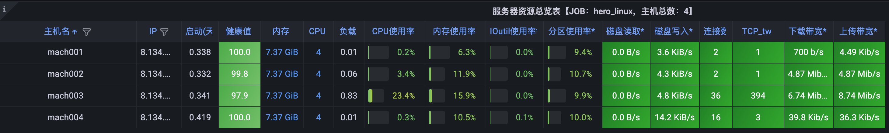
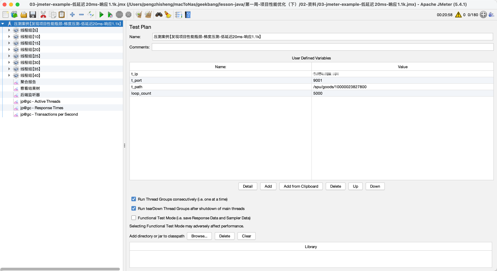
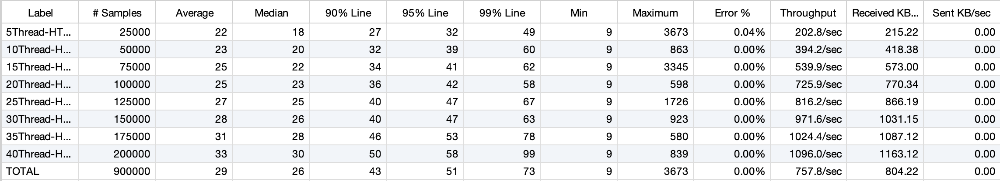
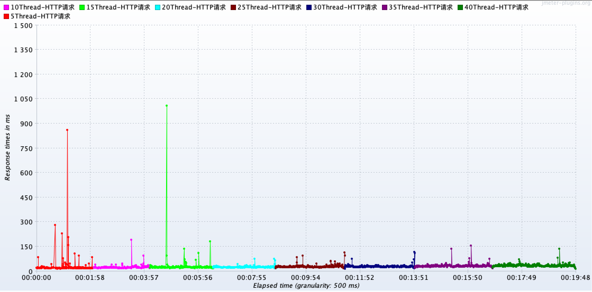
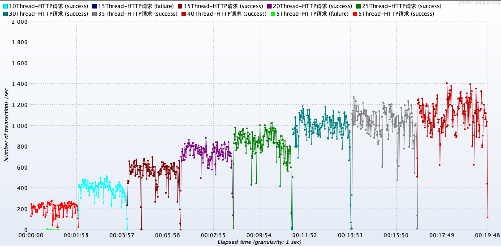
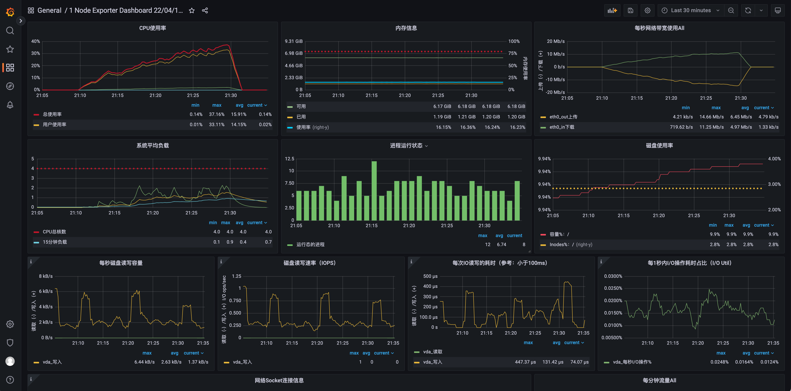
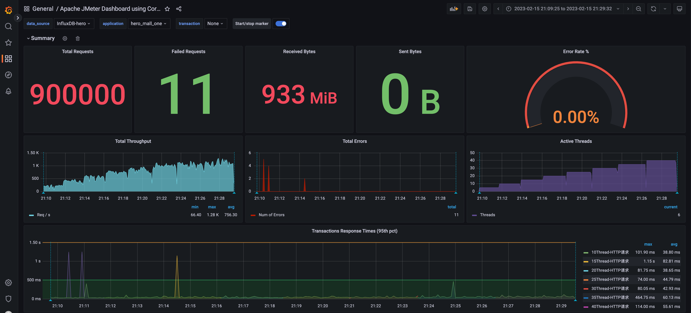
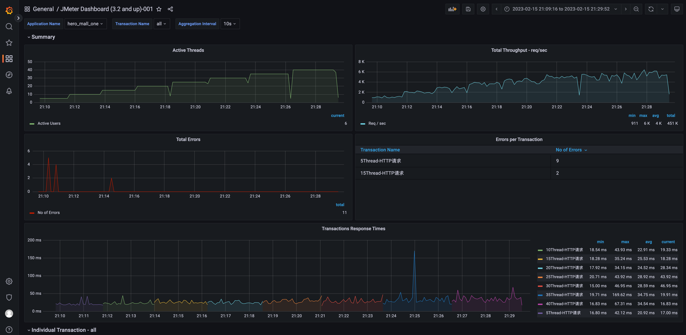

# 第一周作业

## 要求一：搭建好压测平台

## 要求二：使用自己手里的项目的接口完成压测，分析出至少一个性能问题，并给出理由

性能问题：当前服务使用的 Web 服务器为默认的内嵌的 Tomcat，配置也是默认配置，其最大线程数决定了 Web 服务容器可以同时处理多少个请求，默认值是200。故此配置下，Tomcat 所能跑出的最大 TPS 为 1000 左右。如需继续提升 tps，需要根据服务器资源调整 Tomcat 相关配置参数，如：server.tomcat.accept-count、server.tomcat.max-connections、server.tomcat.threads.max、server.tomcat.threads.min-spare。

## 要求三：被测试的接口的性能指标 RT、TPS，系统资源（内存、CPU、磁盘 IO、网络 IO）使用Grafana 观察取证

相关截图如上。

## 要求四：按照 项目性能测试报告 格式提交作业

在 单独的文件：项目性能测试报告.md 中。

