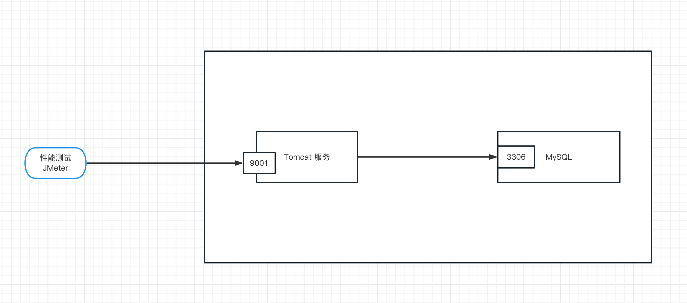
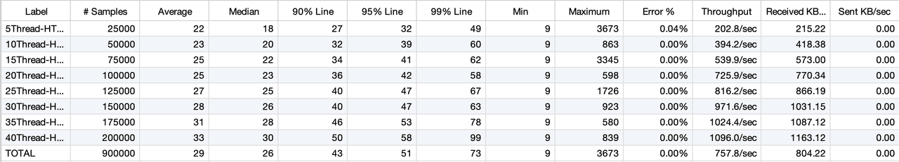
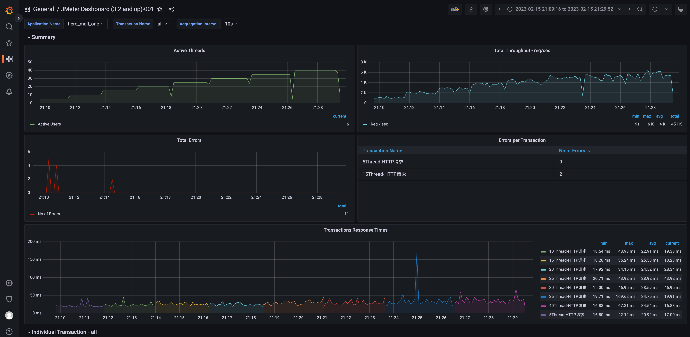

## 01-测试目的

主要是让开发者对 hero_mall 项目的性能负载和容量有个准确的认知。同时，协助技术管理者更好的管理业务系统性能质量，科学评估业务系统的负荷，拒绝盲目上线。


## 02-测试工具




03-测试环境

### 3.1 环境

| 指标              | 参数 |
| ----------------- | ---- |
| 机器              | 4C8G |
| 集群规模          | 单机 |
| hero_mall_one版本 | 1.0  |
| 数据库            | 4C8G |


### 3.2 设置启动参数

```Bash
export JAVA_HOME
export JRE_HOME=${JAVA_HOME}/jre
export CLASSPATH=.:${JAVA_HOME}/lib:${JRE_HOME}/lib


export SERVER_NAME="hero_web"
export JAVA="$JAVA_HOME/bin/java"
export BASE_DIR=`cd $(dirname $0)/.; pwd`
export DEFAULT_SEARCH_LOCATIONS="classpath:/,classpath:/config/,file:./,file:./config/"
export CUSTOM_SEARCH_LOCATIONS=${DEFAULT_SEARCH_LOCATIONS},file:${BASE_DIR}/conf/

JAVA_OPT="${JAVA_OPT} -server -Xms512m -Xmx512m -Xmn256 -XX:MetaspaceSize=128m -XX:MaxMetaspaceSize=320m"
JAVA_OPT="${JAVA_OPT} -XX:-OmitStackTraceInFastThrow -XX:+HeapDumpOnOutOfMemoryError -XX:HeapDumpPath=${BASE_DIR}/logs/java_heapdump.hprof"
JAVA_OPT="${JAVA_OPT} -XX:-UseLargePages"
JAVA_OPT="${JAVA_OPT} -jar ${BASE_DIR}/${SERVER_NAME}*.jar"
JAVA_OPT="${JAVA_OPT} ${JAVA_OPT_EXT}"

JAVA_OPT="${JAVA_OPT} --spring.config.location=${CUSTOM_SEARCH_LOCATIONS}"
if [ ! -d "${BASE_DIR}/logs" ]; then
  mkdir ${BASE_DIR}/logs
fi
echo "$JAVA ${JAVA_OPT}"

if [ ! -f "${BASE_DIR}/logs/${SERVER_NAME}.out" ]; then
  touch "${BASE_DIR}/logs/${SERVER_NAME}.out"
fi

echo "$JAVA ${JAVA_OPT}" > ${BASE_DIR}/logs/${SERVER_NAME}.out 2>&1 &
nohup $JAVA ${JAVA_OPT} hero_web.hero_web --spring.config.location=application-dev.yml >> ${BASE_DIR}/logs/${SERVER_NAME}.out 2>&1 &
echo "server is starting，you can check the ${BASE_DIR}/logs/${SERVER_NAME}.out"
```


## 04-测试场景

测试场景一般情况下是都是最重要接口：验证hero_mall服务获取商品信息接口在不同并发规模的表现

**模拟低延时场景，**用户访问接口并发逐渐增加的过程。接口的响应时间为20ms，线程梯度：5、10、15、20、25、30、35、40个线程，5000次;

- 时间设置：Ramp-up period(inseconds)的值设为对应线程数
- 测试总时长：约等于20ms x 5000次 x 8 = 800s = 13分


## 05-接口的测试结果

### 获取商品信息接口

验证hero_mall服务获取商品信息接口能力性能。**目标峰值TPS：10000，P99响应时间：300ms**

- 压力机-活动线程数  =模拟=> 系统并发用户数
- 系统并发用户数 =不等于=>  压力机-活动线程数  

```Bash
地址：http://8.134.129.191:9001/spu/goods/10000005620800
```

TPS、RT003





## 06-测试结论

hero_web 性能测试是针对重点功能，单机单节点服务进行压测，可以看到该接口容量。本测试供给大家作为参考，如有不足或偏差，请指正！如果对性能有其他需求，可以进行集群扩容。例如:3节点、10节点、100节点...